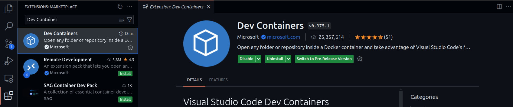

# Failure Prediction #

## Prerequisite  ##
This project requires you to have a `linux` (preferably debian based) host running on an `amd64` platform. <br>
Additionally, the following requirements need to be met:

- [Visual Studio Code](#visual-studio-code)
- [Docker](#docker)
- [Nvidia Container Toolkit for Docker](#nvidia-container-toolkit)

Please refer to the individual sections for detailed instructions.

### Visual Studio Code ###
- Download the `.deb` package for `VS Code` from [this](https://code.visualstudio.com/download) link.
- Make sure you are using the `.deb` package distribution and not using `VS Code` downloaded from snap or other 
distribution channels. Once you have downloaded the `.deb` package, you can run the following command (for debian based host):
    ```
    sudo dpkg -i <path/to/code*.deb>
    ```
- Next, install the `Dev Container` extension in `VS Code`.


### Docker ###
- Please follow the instructions in [this](https://docs.docker.com/desktop/install/linux-install/) link to setup docker on your system.
- It is recommended to install only the docker engine. You do not need to install docker desktop.
- You can use the provided `.deb` package for the docker installation. Or alternatively, install it using the following commands:
    ```
    # update your package database
    sudo apt-get update
  
    # installed required packages
    sudo apt-get install \
    apt-transport-https \
    ca-certificates \
    curl \
    software-properties-common
  
    # add docker's official gpg repository
    curl -fsSL https://download.docker.com/linux/ubuntu/gpg | sudo apt-key add -
  
    # setup the stable docker repository
    sudo add-apt-repository \
    "deb [arch=amd64] https://download.docker.com/linux/ubuntu \
    $(lsb_release -cs) \
    stable"
  
    # update your package database again
    sudo apt-get update
  
    # install docker
    sudo apt-get install -y docker-ce
    ```
- Post installation of `docker engine`, you need to setup a docker group with your local user.
    ```
    # add current user to docker group
    sudo usermod -aG docker $USER
  
    # start new shell session with docker group as the primary group
    newgrp docker
  
    # start docker
    sudo systemctl start docker
  
    # enable docker to start at boot
    sudo systemctl enable docker
  
    # verify docker installation
    docker version
    ```

### Nvidia Container Toolkit ###
- To allow gpu access from within a docker container, you need to have the nvidia container toolkit installed.
- You can get install it by following [this](https://docs.nvidia.com/datacenter/cloud-native/container-toolkit/latest/install-guide.html) link.
- Make sure to configure the docker after installation (see [this](https://docs.nvidia.com/datacenter/cloud-native/container-toolkit/latest/install-guide.html)).
- <b>Troubleshoot:</b> If the `MuJoCo` environment fails to start, you can try to set this value `no-cgroups = false`, in the `/etc/nvidia-container-runtime/config.toml` file.
